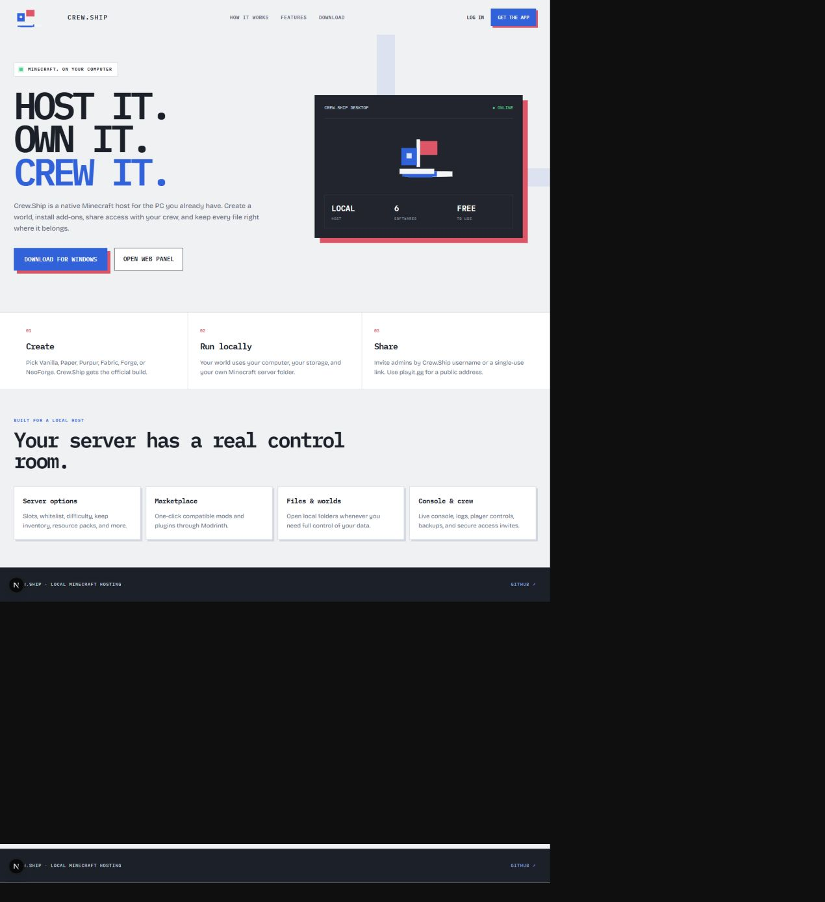
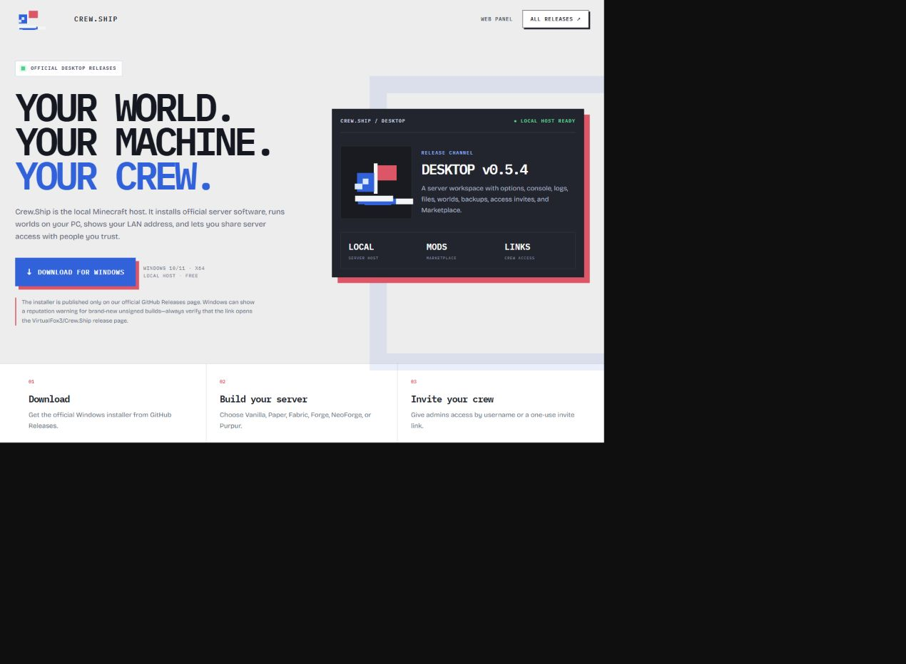

# Crew.Ship

> **Looking for the local desktop host?** Download the official Windows installer from the [Crew.Ship Desktop releases page](https://github.com/VirtualFox3/Crew.Ship/releases). Crew.Ship runs Minecraft servers on the host's own computer, includes local server options, a console, file/world folders, backups guidance, access invites, and Modrinth Marketplace.

Free Minecraft server hosting. No ads, no plugin caps, no paid tier.

An Aternos-style control panel and hosting stack, built to remove the limits
that free hosts normally use as upsell pressure.

| | Crew.Ship | Typical free host |
|---|---|---|
| Price | Free | Free with limits |
| Ads | None | Interstitials + video |
| Plugins | Unlimited | Capped per server |
| Mods | Fabric, Forge, NeoForge, Quilt | Selected packs only |
| Bedrock | Native server **and** Java crossplay | Java only |
| Versions | Every release + snapshot, pulled live | Curated shortlist |
| RAM | Up to 16 GB | Fixed, low |
| Players | Up to 1000 slots | ~20 |
| Queue | First-come, position shown | Skippable for money |

## Screenshots

### Landing page



### Official desktop release page



## What's in here

```
.                     Next.js 15 panel — deploys to Vercel or Cloudflare Workers
├── app/              Pages, and the REST API the panel calls
├── components/       UI kit and the feature components
├── lib/              Domain logic: software catalogue, versions, add-ons, placement
├── supabase/         SQL migrations (schema, RLS, triggers)
└── agent/            Node daemon that runs the actual Minecraft servers in Docker
```

The split matters: **Vercel and Cloudflare cannot host a Minecraft server.**
They run request-scoped functions, not long-lived TCP processes with
gigabytes of resident world data. So the panel deploys there, and one or more
*nodes* — ordinary Linux boxes running `agent/` — do the hosting. The panel
talks to them over an authenticated HTTPS API, and the browser streams the
console straight from the node over a WebSocket.

## Features

**Servers**
- 14 server softwares: Paper, Purpur, Pufferfish, Folia, Spigot, Vanilla,
  Fabric, Forge, NeoForge, Quilt, Bedrock, Velocity, BungeeCord, Waterfall
- Runs on x86 or ARM nodes; the panel hides software the fleet's hardware
  cannot run rather than letting a server fail at start
- Every Minecraft version, pulled live from Mojang, PaperMC, Purpur, Fabric,
  Quilt, Forge and NeoForge — including snapshots and pre-releases
- Switch software or version at any time without losing the world
- Java, Bedrock, or both at once via Geyser + Floodgate crossplay
- 1–16 GB RAM, up to 1000 player slots, 20 GB storage
- playit.gg tunnels built in: a node needs no public IP, no domain and no port
  forwarding, so a home machine works

**Add-ons — no cap**
- Search and one-click install from Modrinth, Hangar and SpigotMC
- Required dependencies resolved and installed automatically
- Install from any direct `.jar` URL
- Enable/disable without uninstalling

**Operations**
- Live streaming console with command history and RCON command execution
- Full file manager with an in-browser editor
- Worlds: list, switch active world, regenerate from a seed
- Backups: snapshot, restore, delete — plain `.tar.gz`, yours to download
- Players: whitelist, operators with levels, bans, live roster
- Every `server.properties` option, plus idle-sleep and JVM flags
- Share a server with friends by username (admin / moderator / viewer)
- Audit log of every action

**Accounts**
- Email + password or Discord OAuth, via Supabase Auth
- Row-level security on every table; a user can only ever see their own
  servers and the ones shared with them

## Quick start

```bash
npm install
cp .env.example .env.local     # fill in Supabase + a random AGENT_SHARED_SECRET
npm run dev
```

Then bring up a node so servers can actually start:

```bash
cd agent
cp .env.example .env           # NODE_ID, the same AGENT_SHARED_SECRET, PANEL_URL
docker compose up -d --build
```

Full instructions, including the Supabase and DNS setup, are in
[DEPLOY.md](./DEPLOY.md).

## How free works

Servers sleep when the last player leaves. A node therefore hosts far more
servers than it has RAM, because almost none of them are awake at once. That
efficiency — not advertising, and not a queue you can pay to skip — is what
pays for the tier. When the fleet is genuinely full, new servers wait in a
strictly first-come queue with the position shown.

## Not affiliated with Mojang or Microsoft

"Minecraft" is a trademark of Mojang Synergies AB. This project is an
independent hosting panel and is not endorsed by or associated with Mojang.
Server software is downloaded from each project's own distribution channel at
start time; nothing proprietary is redistributed here.
